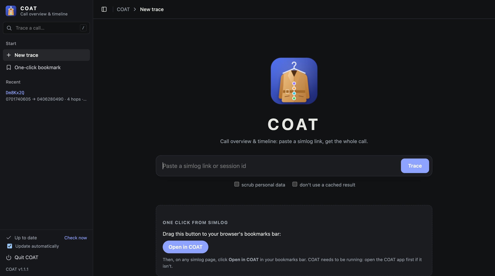

# COAT

**Call Overview And Timeline.** Paste a simlog link, see what happened to the call.

[](https://github.com/archways404/TVX-SOC-COAT/releases/latest)
[](https://github.com/archways404/TVX-SOC-COAT/releases)
[](https://github.com/archways404/TVX-SOC-COAT/actions/workflows/build.yml)
[](docs/user-guide.md#installing-coat)


<sub>A real call, with every number, name and company replaced by fictional ones.</sub>

Simlog, Telavox's internal call log, shows thousands of raw lines from several systems. COAT reads
them for you, follows the call into related sessions (for example when a queue rings an agent), and
shows the whole journey on one page:

- **the route**: every number the call passed through, and *why* it moved on (a keypress, a
  forward, a script, a queue);
- **where the time went**: menus, scripts, waiting in a queue, talking;
- **the outcome**: who answered, who hung up, and anything that went wrong.

## Install

You need a Mac or a Windows PC, and the Telavox **VPN**.

1. Open the **[latest release](https://github.com/archways404/TVX-SOC-COAT/releases/latest)**.
2. Under **Assets**, download the file for your computer:
   - **Mac:** `COAT_v….zip`. Double-click it, then drag **COAT** into Applications.
   - **Windows:** `COAT_v….exe`. Put it somewhere handy, like the desktop.
3. Open COAT. The first time, your computer asks whether to trust it: the
   [user guide](docs/user-guide.md#the-first-time-you-open-it) shows the one-time steps.

On a Mac with [Homebrew](https://brew.sh) you can instead run `brew install --cask archways404/tap/coat`.

COAT updates itself after that. Want to try what's coming next? [COAT Preview](docs/user-guide.md#coat-preview)
is a green preview app that installs next to COAT.

## Use



1. Double-click **COAT**. Its start page opens in your browser.
2. Paste a simlog link or session id. The trace starts by itself.
3. Read the report. **Copy route as text** gives you a short version for a ticket.

Also handy:

- **Open in COAT**, a bookmark that opens any simlog page in COAT
  ([how](docs/user-guide.md#one-click-from-simlog));
- **Keep long-term**, which keeps a call in simlog for about 10 years instead of a few weeks;
- **Quit COAT**, at the bottom of the sidebar.

<br clear="right">

## Documentation

| Read | If you want to |
|---|---|
| [User guide](docs/user-guide.md) | install COAT, read a report, or fix a problem |
| [How it works](docs/how-it-works.md) | know how log lines become a route, in plain language |
| [Privacy and security](docs/privacy-and-security.md) | know what data COAT handles and where it goes |
| [Development](docs/development.md) | change the code. No Rust experience needed. |
| [Releasing](docs/releasing.md) | publish a version: the stable and preview channels, and version numbers |

## Developers

COAT is one program written in [Rust](https://www.rust-lang.org/). It runs a small web server on
your own computer and shows its pages in your browser. Install Rust with [rustup](https://rustup.rs/), then:

```sh
cargo test                        # run the tests
cargo run --release               # start COAT, like double-clicking it
cargo run --release -- --help     # the command-line options
```

The simlog address is internal, so it isn't in the code. To point a local build at it, see
[Development → Pointing COAT at simlog](docs/development.md#pointing-coat-at-simlog).
