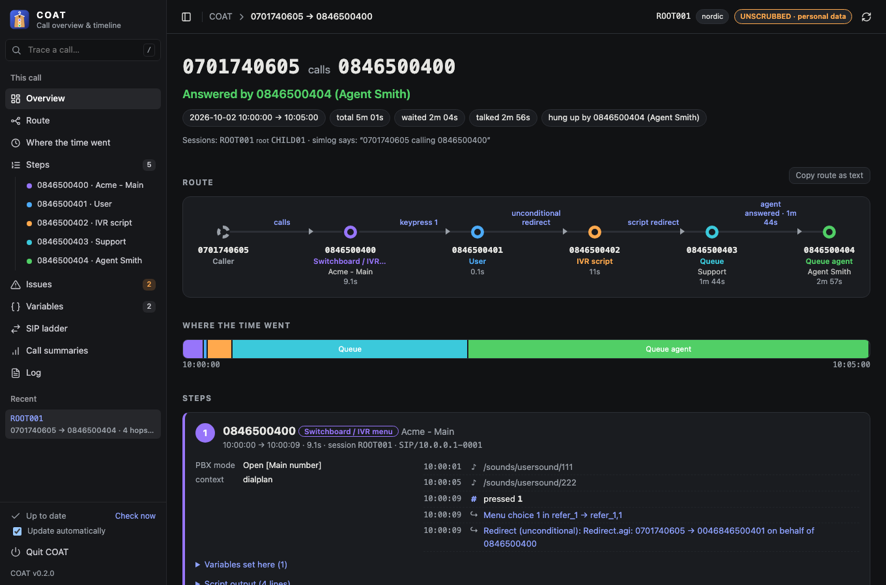

# COAT: Call Overview And Timeline

[](https://github.com/archways404/TVX-SOC-COAT/releases/latest)
[](https://github.com/archways404/TVX-SOC-COAT/releases)
[](https://github.com/archways404/TVX-SOC-COAT/actions/workflows/build.yml)
[](docs/user-guide.md#installing-coat)


COAT explains what happened to a phone call. Give it a link from **simlog**, Telavox's internal
call log tool, and it shows the whole journey of the call on one page:

- every number the call passed through, and **why** it moved on each time (a keypress, a
  forward, an automated script, a queue);
- where the time went (menus, scripts, waiting in a queue, talking);
- who answered, who hung up, and anything that went wrong along the way.

Simlog itself shows thousands of raw log lines from several systems. COAT reads all of them for
you, follows the call into the related sessions (for example when a queue rings an agent), and
turns them into a short story.



*The screenshot uses a made-up call; all numbers and names are fictional.*

## Get it

COAT runs on **Mac** and **Windows**. You need to be connected to the Telavox **VPN**.

Open the **[newest release](https://github.com/archways404/TVX-SOC-COAT/releases/latest)** and, under **Assets**, download:

| Your computer | File | Then |
|---|---|---|
| Mac | `COAT_v1.2.3.zip` (with the newest version number) | Double-click to unzip, and drag **COAT** into Applications. |
| Windows | `COAT_v1.2.3.exe` | Put it somewhere handy, for example the desktop. |

Or, on a Mac with [Homebrew](https://brew.sh): `brew install --cask archways404/tap/coat`.

The first time you open COAT your computer asks whether to trust it. The
[user guide](docs/user-guide.md#the-first-time-you-open-it) shows the one-time steps. After that,
COAT keeps itself up to date.

Want to try what's coming next? [COAT Preview](docs/user-guide.md#coat-preview) is a green preview
app that installs next to COAT. Its files end in `_PREVIEW`.

## Use it

1. Double-click **COAT**. Your web browser opens COAT's start page.
2. Paste a simlog link (or just the session id) into the box. The trace starts by itself.
3. Read the report. Use **Copy route as text** to paste the short version into a ticket.

To stop COAT, click **Quit COAT** in the page. There's also a one-click bookmark for opening any
simlog page in COAT: see the [user guide](docs/user-guide.md#one-click-from-simlog). Need the call
later? **Keep long-term** in the report keeps it in simlog for about 10 years instead of a few weeks.

## Documentation

| Document | For | What's in it |
|---|---|---|
| [User guide](docs/user-guide.md) | everyone | Installing, using COAT, reading a report, fixing common problems |
| [How it works](docs/how-it-works.md) | the curious, support, developers | How COAT turns log lines into a route, in plain language, with a glossary |
| [Privacy and security](docs/privacy-and-security.md) | everyone | What data COAT handles, where it goes, and how it's protected |
| [Development](docs/development.md) | developers, **no Rust experience needed** | Setting up, a tour of the code, running the tests, common changes |
| [Releasing](docs/releasing.md) | maintainers | The stable and preview channels, version numbers, and how releases are published automatically |

## For developers in one minute

COAT is a single program written in [Rust](https://www.rust-lang.org/). It runs a small web
server on your own computer and shows its pages in your browser. To build it, install Rust with
[rustup](https://rustup.rs/), then:

```sh
cargo test                        # run the tests
cargo run --release               # build and start COAT, like double-clicking it
cargo run --release -- --help     # the command-line options
```

A local build doesn't know where simlog is, because that address is internal and not in the code.
[Development → Pointing COAT at simlog](docs/development.md#pointing-coat-at-simlog) explains how
to set it.
